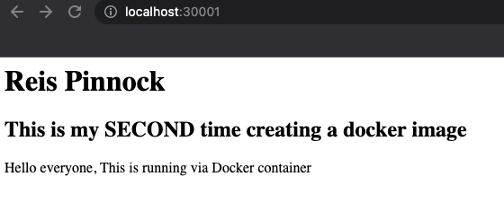
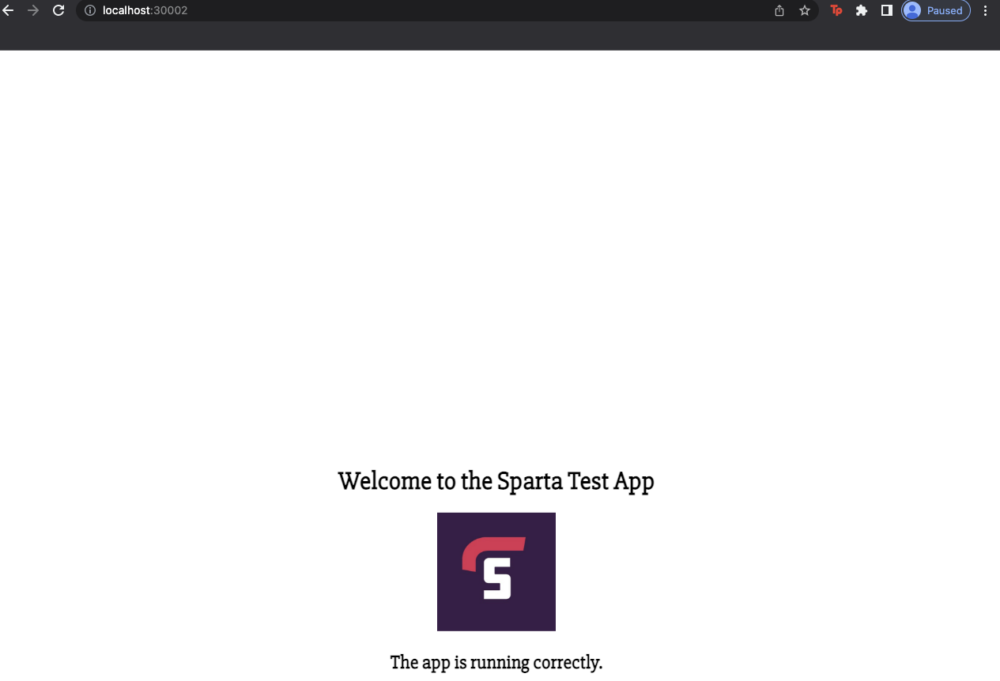

# Kubernetes (K8s)

Kubernetes is an open source container orchestration engine for automating deployment, scaling, and management of containerized applications.

#### When not to use Microservices

Microservices architecture is a great way to manage a large project, thanks to it flexibility and scalibility. However, it also requires a high maintanance and a high cost. So if your project is of a small scale and there is no plan of expanding and growing in the future, then it might be much simplier and more cost effective to use a Monolith or N-tier architecture instead.

#### When not to use K8 - disadvantages

* You don't need K8 unless you have a large-scale application that run on multiple services that communicate with each other
* It involves steep learning curve, so it might take time to learn how to use it
* Requires learning of multiple tools
* Requires high maintanance and cost

### Kubernetes Deployment

1. Within docker we first need to enable kubernetes in the settings.

<br>

2. within our directory we need to create a YAML file 

- ```sudo nano nginx-deploy.yml```

3. In this file you need to add the information neccissary for kubernetes 

```
apiVersion: apps/v1 # which api to use for deployment

kind: Deployment # what kind of service/object do you want to create?

# what would you like to call it - name the service/object


metadata:
  name: nginx-deployment
spec:
  selector: 
    matchLabels:
      app: nginx
  replicas: 3

  template:
    metadata:
      labels:
        app: nginx
    
    spec: 
      containers:
      - name: nginx
        image: jakegillatt/sparta-app:jake_app
        ports:
        - containerPort: 80

```

4. We then need to create the cluster 

- ```kubectl create -f nginx-deploy.yml```

5. Can check the clusters 

- ```kubectl get deploy```

6. we can check specific pods with:

- ```kubectl get pods```

7. But now we need to start a service, to expose the image on the broswer, we can check services with 

- ```kubectl get service```

- ``` kubectl delete deploy <name_of_deployement>```

### Creating a service

Now we have deployed our nodes we need to expose them using a service. 

1. firstly create a YAML file `nginx-service.yml`, within this add the following code:

```
# Select the type of API version and type of service/object
apiVersion: v1
kind: Service

# Metadata for name
metadata:
  name: nginx-svc
  namespace: default #sre
# Specification to include ports Selector to connect to the ?
spec:
  ports:
  - nodePort: 30001 # range is 30000-32768
    port: 80


    targetPort: 80

  # lets define the selector and label to connect to nginx deploment
  selector:
    app: nginx 

  # Creating NodePort type of deployement 
  type: NodePort 
```

2. Now within our terminal we can start this service 

- ``` create -f nginx-service.yml ```

3. We can verify this service exposed the node by navigating on our local host with port `30001`




#### deploying a exposing node.js app 

We need to follow the above steps for nginx but ammending files to open ports to 3000 and change respective names 

1. Make a deploy YAML file called: `sparta-app-deploy.yml`

<br>

2. Within this file add:

```
apiVersion: apps/v1 # which api to use for deployment

kind: Deployment # what kind of service/object do you want to create?

# what would you like to call it - name the service/object


metadata:
  name: sparta-app-deployment
spec:
  selector: 
    matchLabels:
      app: node
  replicas: 3

  template:
    metadata:
      labels:
        app: node
    
    spec: 
      containers:
      - name: node
        image: reiscodes/sparta_app:v2
        ports:
        - containerPort: 80
```

3. We can then deploy this with 

- ```kubectl create -f sparta-app-deploy.yml ```

4. Then we need to make the service file, `sparta-app-service.yml`

<br>

5. Add the following code to this file

```
# Select the type of API version and type of service/object
apiVersion: v1
kind: Service

# Metadata for name
metadata:
  name: node-svc
  namespace: default #sre
# Specification to include ports Selector to connect to the ?
spec:
  ports:
  - nodePort: 30002 # range is 30000-32768
    port: 3000


    targetPort: 3000

  # lets define the selector and label to connect to nginx deploment
  selector:
    app: node 

  # Creating NodePort type of deployement 
  type: NodePort 
```

6. Starting this service with 

- ```kubectl create -f sparta-app-deploy.yml```

7. We can again verify this has been deployed and exposed succesfully by navigating to our localhost on port 30002. 



